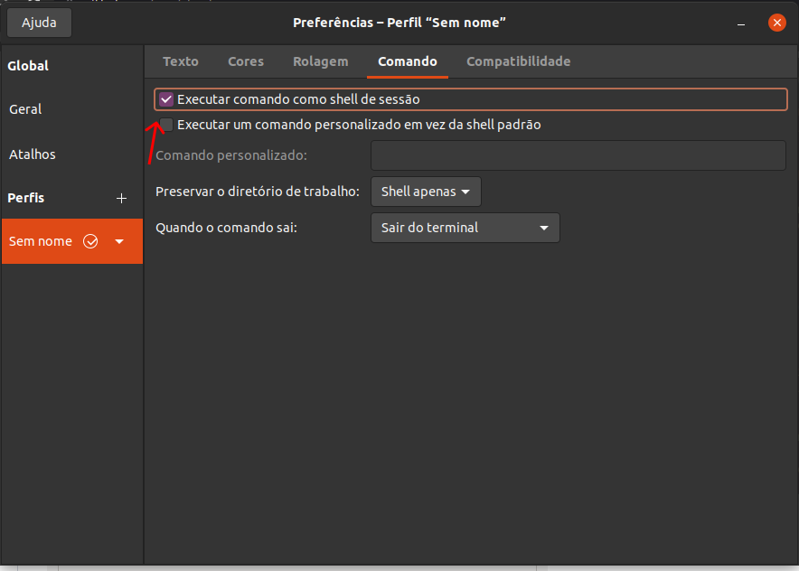

# configurando-ambiente-tray
# Configurando um ambiente de desenvolvimento Tray

> ⚠️ Atenção, esse artigo foi feito no dia 21/01/2022. Entretanto, as dependências estão sujeitas a qualquer tipo de mudança.
> 

---

### Instalando o RVM

1. Para prosseguir instale o `software-properties-common`
    
    ```bash
    sudo apt-get install software-properties-common
    ```
    
2. Adicione o repositório e instale o rvm
    
    ```bash
    sudo apt-add-repository -y ppa:rael-gc/rvm
    sudo apt-get update
    sudo apt-get install rvm
    ```
    
3. Adicione o seu usuário ao grupo rvm
    
    ```bash
    sudo usermod -a -G rvm $USER
    ```
    
4. Mude essa configuração no seu terminal
    
    
    
5. Reinicie sua máquina
6. Instale as gems na sua maquina
    
    ```bash
    rvm user gemsets
    ```
    
7. Instale a versão do RVM que deseja (para usar na Tray é recomendado 2.3)
    
    ```bash
    rvm install ruby 2.3
    ```
    

### Instale agora o Opencode

```bash
gem install opencode_theme
```

### Agora é hora de resolver os erros

```bash
#Instalando faraday
gem install faraday -v 1.0.1

#instalando launchy
gem install launchy -v 2.4.3

#instalando o racc
gem install racc -v 1.5.2

#instalando o nokogiri
gem install nokogiri -v 1.10.10
```

### Instalando o gulp

```bash
#instale o nvm
sudo apt install curl 
curl https://raw.githubusercontent.com/creationix/nvm/master/install.sh | bash

#instale a última versão lts do node
nvm install --lts

#finalmente instale o gulp
npm i -g gulp-cli

#atualize seu npm
npm i -g npm@8.3.2
```
